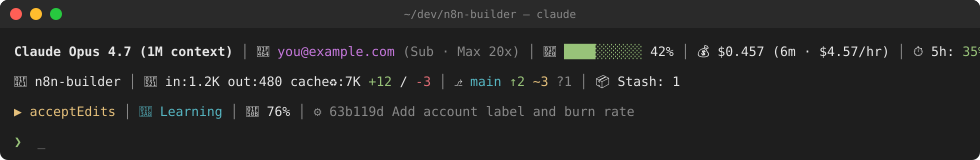

# claude-statusline

> A multi-line, color-coded status line for [Claude Code](https://claude.com/claude-code) — your model, account, context, cost, rate limits, git state, permission mode, and more, all visible at a glance.


-supported-success)




---

## Why

The default Claude Code status line shows the model and not much else. Once you spend serious hours in Claude Code, you start asking yourself:

- **Which account am I logged into right now?** (subscription vs API, which email?)
- **How much have I spent in this session, and how fast am I burning?**
- **How close am I to the 5h / 7d rate limit?**
- **Am I in `acceptEdits`? `plan`? Did I forget I switched?**
- **What's my git state — am I behind upstream? Got stashes I forgot about?**
- **Is my battery about to die mid-session?**

This status line answers all of those, on every prompt, without you having to ask.

---

## Quick install

### macOS / Linux / Windows Git Bash

```bash
git clone https://github.com/ak-singla/claude-statusline ~/.claude-statusline
bash ~/.claude-statusline/install.sh
```

> ⚠️ **Run this in a shell that expands `~`** (bash / zsh / Git Bash). PowerShell and `cmd.exe` do **not** expand `~`, so running the same line there will create a literal `~` folder (`C:\Users\you\~\.claude-statusline\`). If you're on Windows, either open Git Bash *or* use the PowerShell installer below.

### Windows (PowerShell)

```powershell
git clone https://github.com/ak-singla/claude-statusline "$env:USERPROFILE\.claude-statusline"
powershell -ExecutionPolicy Bypass -File "$env:USERPROFILE\.claude-statusline\install.ps1"
```

The PowerShell installer is a 1:1 equivalent of `install.sh` — it uses absolute Windows paths (no `~` expansion required) and writes a `bash "C:/Users/you/.claude/statusline.sh"` command into `settings.json`. You still need Git for Windows installed, since the statusline itself is bash. `jq` is auto-installed via Chocolatey, Scoop, or winget if missing.

### What the installer does

1. Detect your OS (macOS / Linux / Windows Git Bash / Windows PowerShell).
2. Install `jq` if missing — via Homebrew, apt, dnf, yum, pacman, zypper, apk, Chocolatey, Scoop, or winget (auto-detected).
3. Copy the script to `~/.claude/statusline.sh`.
4. **Windows only:** also write a `~/.claude/statusline.cmd` wrapper that invokes Git Bash's absolute `bash.exe` with the statusline. This is what `settings.json` actually points to — it shields you from `bash` resolving to `C:\Windows\System32\bash.exe` (the WSL launcher) and from path-with-spaces quoting hazards in Claude Code's command spawn.
5. Patch `~/.claude/settings.json` with the `statusLine` block, **preserving every other setting you have**.
6. Back up anything it overwrites.

Send a new message in Claude Code — your status line is live.

---

## Update

When a new version ships, run:

```bash
# macOS / Linux / Git Bash
bash ~/.claude-statusline/update.sh

# Windows PowerShell
powershell -ExecutionPolicy Bypass -File "$env:USERPROFILE\.claude-statusline\update.ps1"
```

It fast-forwards the repo and refreshes `~/.claude/statusline.sh`. No `settings.json` changes, no backup churn.

---

## Uninstall

```bash
# macOS / Linux / Git Bash
bash ~/.claude-statusline/uninstall.sh

# Windows PowerShell
powershell -ExecutionPolicy Bypass -File "$env:USERPROFILE\.claude-statusline\uninstall.ps1"
```

Removes the `statusLine` block from `settings.json` (leaving everything else untouched) and deletes the script. Backups are kept. The repo clone stays on disk in case you change your mind.

---

## Anatomy

The status line prints up to **three lines** per prompt. Line 3 is suppressed entirely if there's nothing interesting to put on it.

### Line 1 — session

```
Claude Opus 4.7 (1M context) │ 👤 you@example.com (Sub · Max 20x) │ 🧠 ████░░░░░░ 42% │ 💰 $0.457 (6m · $4.57/hr) │ ⏱ 5h: 35%→2h0m │ 📅 7d: 12% │ 🕐 14:32:01
```

| Element | Example | What it tells you |
|---|---|---|
| **Model** | `Claude Opus 4.7 (1M context)` | Active model + context window size |
| **Account** | `👤 you@example.com (Sub · Max 20x)` | Which Claude account you're logged into. Shows `(Sub · <tier>)` for subscription, or `(API)` if `ANTHROPIC_API_KEY` is set |
| **Context bar** | `🧠 ████░░░░░░ 42%` | % of context used. Bar color: 🟢 <50% → 🟡 <80% → 🔴 ≥80% |
| **Cost & burn rate** | `💰 $0.457 (6m · $4.57/hr)` | Session cost, elapsed time, and dollars-per-hour burn |
| **5h limit** | `⏱ 5h: 35%→2h0m` | 5-hour rate-limit usage and time until reset |
| **7d limit** | `📅 7d: 12%` | 7-day rate-limit usage |
| **Time** | `🕐 14:32:01` | Wall-clock time |

### Line 2 — workspace

```
📁 n8n-builder │ 🔡 in:1.2K out:480 cache♻:7K +12/-3 │ ⎇ main ↑2 ~3 ?1 │ 📦 Stash: 1
```

| Element | Example | What it tells you |
|---|---|---|
| **Folder** | `📁 n8n-builder` | Current working directory (basename only) |
| **Tokens** | `🔡 in:1.2K out:480 cache♻:7K` | Last turn's input / output / combined cache (read + write) tokens |
| **Lines changed** | `+12/-3` | Lines added / removed by Claude in this session |
| **Branch** | `⎇ main` | Current git branch (cyan) |
| **Ahead/behind** | `↑2 ↓1` | Commits ahead of / behind upstream |
| **Dirty state** | `+2✓ ~3 ?1` | Staged ✓ / modified ~ / untracked ? counts |
| **Stash** | `📦 Stash: 1` | Number of stashes (only shown when > 0) |

### Line 3 — mode & system (only when something changes)

```
▶ acceptEdits │ 🎨 Learning │ 🔋 76% │ ⚙ 63b119d Add account label and burn rate
```

| Element | Variants | What it tells you |
|---|---|---|
| **Permission mode** | `▶ default` (dim) · `▶ acceptEdits` (yellow) · `📋 plan` (blue) · `▶ bypass` (red) | Claude Code's current permission mode |
| **Output style** | `🎨 Explanatory` · `🎨 Learning` (cyan) | Active output style. **Hidden when on Default** |
| **Battery** | `🔋 76%` (discharging) · `🔌 100%` (charging) | macOS only. Color-coded: 🟢 ≥50%, 🟡 20–49%, 🔴 <20% |
| **Last commit** | `⚙ 63b119d Add account label and burn rate` | Most recent git commit (truncated to 60 chars) |

Line 3 is suppressed entirely if none of these are set (e.g. outside a git repo, on default mode/style, on a desktop without battery).

---

## Requirements

| Tool | Why | Auto-installed by `install.sh`? |
|---|---|---|
| `bash` | Run the script | No (assumed present) |
| `jq` | Parse the session JSON Claude Code pipes in | **Yes** |
| `git` | Show git state | No (optional — script silently skips git info if absent) |

The script does **not** require Python, Node, curl, or anything else. It's pure bash + jq.

---

## OS support

| OS | Status | Notes |
|---|---|---|
| **macOS** | ✅ Full | Battery via `pmset` (negligible cost — reads cached IOKit state) |
| **Linux** | ✅ Full | Everything except battery |
| **Windows (Git Bash / MSYS2)** | ✅ Full | Auto-normalizes `D:/foo` and `D:\foo` paths to `/d/foo` for `git -C`. Battery skipped |
| **Windows (PowerShell installer)** | ✅ Full | Use `install.ps1` to set up paths and `settings.json` natively. The runtime statusline is still bash, so Git for Windows must be installed |

WSL works as Linux. The runtime script (`statusline.sh`) is bash — `install.ps1` only handles install/uninstall/update on Windows so you don't get bitten by `~`-expansion in PowerShell.

---

## Customizing

The installed script lives at `~/.claude/statusline.sh` and is a single self-contained bash file. Open it and edit. Common tweaks:

- **Change colors:** the ANSI variables at the top (`GREEN`, `YELLOW`, `RED`, `CYAN`, `MAGENTA`, `BLUE`, `DIM`, `BOLD`).
- **Hide an element:** comment out its `printf` line near the bottom.
- **Change separators:** the `│` character is used between elements — search & replace it.
- **Reorder lines:** the three `printf` blocks at the bottom are independent and can be rearranged.

If you want your local edits to survive `update.sh`, fork the repo and clone your fork instead of the upstream.

---

## How it works

Claude Code runs the command in `settings.json` → `statusLine.command` after every prompt. It pipes a JSON document with session state into the command's stdin. The script:

1. Reads stdin and parses it with `jq` (model, context, cost, rate limits, etc.).
2. Reads `~/.claude.json` separately for OAuth account info (email, plan tier).
3. Queries `git` for branch / status / upstream / stash / last commit.
4. Calls `pmset` (macOS only) for battery.
5. Prints up to 3 colored lines to stdout.

Claude Code displays whatever is on stdout. That's the entire mechanism — nothing fancier.

---

## Troubleshooting

<details>
<summary><strong>Status line doesn't appear at all</strong></summary>

- Check the `statusLine` block exists in `~/.claude/settings.json`:
  ```bash
  jq '.statusLine' ~/.claude/settings.json
  ```
- Make sure the script is executable: `chmod +x ~/.claude/statusline.sh`
- Manually test it: `echo '{}' | sh ~/.claude/statusline.sh` — should print at least one line.

</details>

<details>
<summary><strong>Account shows as missing or wrong</strong></summary>

The script reads `~/.claude.json` → `oauthAccount.emailAddress`. If you're using API key auth instead, set `ANTHROPIC_API_KEY` in your environment and the script will show `(API)` instead of a subscription tier.

</details>

<details>
<summary><strong>Git ahead/behind always shows 0</strong></summary>

Your branch needs an upstream. Set one with:
```bash
git branch --set-upstream-to=origin/main main
```

</details>

<details>
<summary><strong>jq install failed on Linux</strong></summary>

Run the appropriate command for your distro manually:
- Debian/Ubuntu: `sudo apt-get install jq`
- Fedora: `sudo dnf install jq`
- Arch: `sudo pacman -S jq`
- Alpine: `apk add jq`

Then re-run `install.sh`.

</details>

<details>
<summary><strong>I want to revert to the default Claude Code status line</strong></summary>

Run `uninstall.sh`. It removes the `statusLine` block from your settings (preserving everything else) and deletes the script.

</details>

---

## Versioning

This project follows [SemVer](https://semver.org/). The current version is in [VERSION](./VERSION). Tagged releases will appear at [Releases](https://github.com/ak-singla/claude-statusline/releases).

---

## Contributing

PRs and issues welcome. Before opening a PR:

1. Test on at least one OS you have access to.
2. Update the README if you add or change a visible element.
3. Bump VERSION in your PR (patch for fixes, minor for new fields, major for breaking changes to settings.json or the script's stdin contract).

If you've got an idea but no time to PR, open an [issue](https://github.com/ak-singla/claude-statusline/issues) — designs and feature requests are welcome.

---

## License

[MIT](./LICENSE) — use it however you want.

---

## Author

Built and maintained by [**Ankit Singla**](https://github.com/ak-singla).

If this saves you time, a ⭐ on the repo is the kindest possible thanks.
